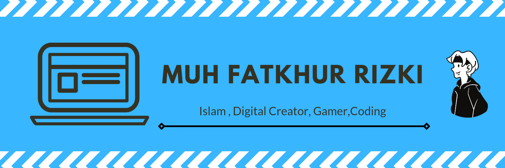

<!-- Banner -->

<!-- Intro Cards -->

   

<!-- Heading -->
<h1> 
Hai, Yang Disana ,Saya Muhamad fatkhur rizki
</h1>
<!-- Body -->

Saya seorang Islam, Developer,Tiktok and Youtube content creator. My youtube channels <a href="http://www.youtube.com/UCkvyvWEOcjzdrlcfWSinQyQ" target="_blank">MFR GAMING</a> & <a href="https://www.tiktok.com/@mf.rizki" target="_blank">MFRizki</a>.Saya dari Indonesia dan mulai coding hanya dengan ponsel saya pada tahun 2021 selama pandemi Covid. Tidak mudah hanya menggunakan ponsel untuk menulis kode dan belajar, tetapi dengan bantuan Tuhan saya dapat melewati masa sulit itu. Saya memiliki minat yang besar pada komputer jauh sebelum pandemi Corona, tetapi saya tidak ingin terlalu banyak mengalihkan perhatian dari gamer saya.

<ul>
<li>💫 Saya bertujuan untuk menjadi Pengembang 👨‍💻dan Pencipta Digital yang hebat 🎥.</li>
<li>👯Saya ingin berkolaborasi dengan pembuat konten lainnya.</li>
<li>⚡ Fakta menarik tentang saya: Saya suka mengedit, bermain game, tetapi di atas semua itu, saya suka kode.</li>
</ul>

<!-- Social Media Links -->
<h2>📱 Terhubung dengan saya:</h2>

<h2>💬 Languages:</h2>

<h2>📚 Libraries:</h2>

<h2>🛠 Tools:</h2>

<h2 align="center"> 📺 MFR Gaming Tiktok Videos </h2>

<!-- MFRizki-TIKTOK:START -->
- [Johnson X Nana Combo](https://vt.tiktok.com/ZSeWNGYRM/)
- [Fanny Challange](https://vt.tiktok.com/ZSeWNV4Ck/)
<!-- MFRizki-TIKTOK:END -->

➡️ <a href="https://www.youtube.com/UCkvyvWEOcjzdrlcfWSinQyQ">View More</a>
<h2 align="center"> 📺 Latest MFrizki YouTube Videos </h2>

<!-- MFRizki-Youtube:START -->
- [New](https://www.youtube.com/watch?v=)
- [Popular](https://www.youtube.com/watch?v=)
<!-- MFRizki-TIKTOK:END -->

➡️ <a href="https://www.youtube.com/channel/UCkvyvWEOcjzdrlcfWSinQyQ">View More </a> 
<h2 align="center"> 👌 GitHub Stats </h2>

